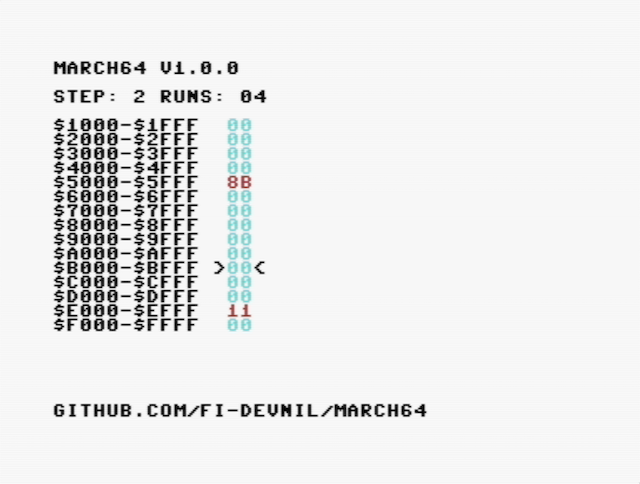

# !!!ARCHIVED!!!

This project has been archived and will not be updated and using it should be avoided. It has a bug that causes it to only scan a small part of the memory. 
A partial fix has been started in the 1.1.0 branch but I see no need to further update this project since better solutions exist.

For your memory testing needs I would like to refer you to use any of the following: [DesTestMax](https://factorofmatt.com/destestmax) or [DesTestFull](https://factorofmatt.com/destestfull).

# MARCH64

March U memory test for the Commodore 64.

Developed using the VS64 extension for VS Code and the ACME assembler.

This is my first ever program written in any assembly language so I do apologize for any weird or frankly terrible code.

I have tested this using VICE and my C64 Assy. 250425 using a Kung Fu Flash.



*Note: Screenshot is from VICE*

## What does it do?

It tests the address range \$1000-\$ffff. You can read more about march tests and their differences [here](https://www.researchgate.net/publication/3349024_March_U_A_test_for_unlinked_memory_faults).

## Why not test the entire 64k?

Testing the first 4k of memory ($0000-$0fff) is slightly more complicated.

If you need to test this address range then please use the awesome DesTestMAX by Factor of Matt, available [here](https://factorofmatt.com/destestmax).

## How to build

This project is built using the ACME assembler.

```
acme -f plain -o march64.crt -I lib src/march64.asm
```

You can also download a pre-built crt file from the Releases section.

## Huge thanks to the following (in no particular order):
**Codebase64**

Very useful resource for learning how to code assembly for the 6502, with useful snippets of code. I would like to especially thank Bruce Clark for their compact memory mover (see [here]()) and Csanyi Pal for their example on how to set up the cartridge headers for autostarts (see [here](https://codebase64.org/doku.php?id=base:assembling_your_own_cart_rom_image#cbm80_autostart_cartridge_developed_with_dreamass)).

**Lemon64**

Many a problem was solved by finding a thread on Lemon64, again many times with useful code snippets. Visit lemon64 [here](https://www.lemon64.com).

**David Giller**

His xtramtest (available [here](https://github.com/ki3v/xtramtest)) was a huge help in how to structure a project like this in assembly.

**Adrian Black**

Watching his videos about C64 repair gave me the idea to try and create this. You can watch his videos [here](https://www.youtube.com/@adriansdigitalbasement).

**Everyone else**

I most likely forgot someone here so a huge thank you to the entire community!

## License
This project is licensed under the GNU General Public License, version 2.
